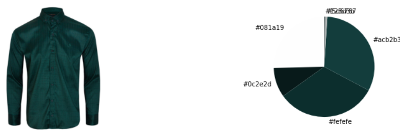

Digikala is a prominent Iranian e-commerce platform offering a wide range of products, from digital devices and mobiles to laptops, books, and clothing. In this project, my focus was on creating a specialized clothing search engine based on exact color preferences and clothing types. The project primarily centers on men's t-shirts and shirts to showcase the functionality of the system.

[Project Github Repository](https://github.com/meysamraz/digikala-clothing-search-by-color)

### Demo:

<https://meysamraz-cloth-color-search-digikala-project.streamlit.app/>

### Demo ***Heroku version***:

**Update:** Heroku may discontinue free hosting after November 28, 2022. If this link does not work, please use the link above.

<https://clothing-search-by-color.herokuapp.com/>

# **Project Preview:**

## **1. Data Collection:**

*   Data collection was achieved by extracting data from a hidden API provided by Digikala, a prominent Iranian e-commerce platform. This method was chosen for simplicity and effectiveness.

## **2. Data Preprocessing:**

*   Preprocessing involved several key steps:

    *   Dropping null values to ensure data quality.

    *   Creating a "Type of Cloth" column to categorize clothing items.

    *   Creating a "Color" column to represent the color of each item.

## **3. Image Color Detection:**

*   For image color detection, the K-Means clustering algorithm was employed. A threshold value and specific conditions were applied to accurately identify colors on various clothing items.

## **4. Front-End Development:**

*   The front-end of the project was built using Streamlit, a Python library for creating web applications. Streamlit offers a straightforward approach to web development entirely in Python. However, some limitations were encountered when customizing certain widgets, particularly in the color selection section.

## **5. Deployment:**

*   The project was made accessible online through Heroku, a cloud platform as a service. Heroku provided a flexible hosting solution for deploying the application.

## **Installation and Execution:**

*   To run the project, follow these steps:

    *   Install the necessary requirements using `pip install -r requirements.txt`.

    *   Execute the project with `streamlit run main.py`.

## **Libraries and Frameworks Used:**

*   Streamlit

*   Flask

*   Pandas

*   scikit-learn

*   Heroku

## **Future Updates:**

*   In future iterations of this project, I plan to implement the following enhancements:

    *   Expand the clothing categories to provide a more comprehensive search experience.

    *   Improve the accuracy and granularity of color detection .

    *   Enhance the user interface and interactivity to address Streamlit's limitations.

    *   Explore advanced image analysis techniques to extract more detailed clothing attributes.
