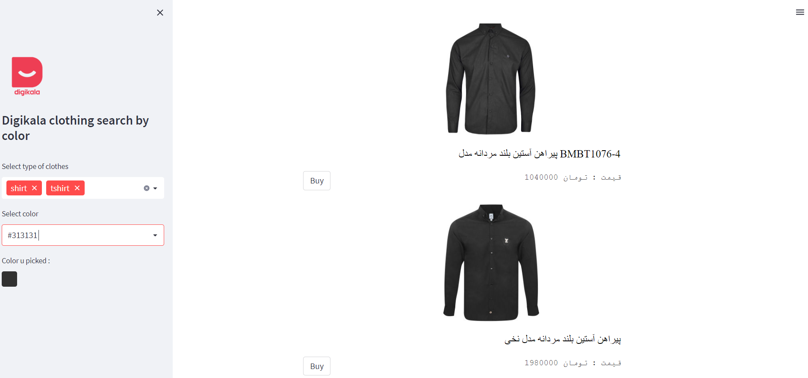

# Digikala Clothing Search By Color

Digikala is an popular Iranian e-commerce company They have many products for sale, including digital devices, mobiles, laptops, books and clothes. In this project, I focused on the clothing part. I tried to make a search engine based on the exact color you want and the type of clothes you choose. To show you the result, I focused on men's t-shirts and shirts 

### Watch Demo here  : 

https://meysamraz-cloth-color-search-digikala-project.streamlit.app/


### Watch Demo here ***heroku version*** : 
##### update : heroku may shutdown free hosting at 2022 - 28 nov so if this link didnt work use link above 

https://clothing-search-by-color.herokuapp.com/


<p></p>


# Project Preview : 

## 1 - Collect the data : 
There are many ways to collect data you scrap or using a bot crawel i used the easist ***(fetch data from hidden api)*** 

# 2 - Preprocess data : 
- Drop null values 
- Create type of cloth column 
- Create color column  

# 3 - Detect cloth image color :
For detecting images colors I used Kmeans to cluster colors. i made a thershould value  and some conditions to detect colors on clotheses
<p></p>


# 4 - Front side : 
I used Streamlit to front side. An awesome library for building web apps entirely in Python. Unfortunately, Streamlit has limitations for customizing my necessary widgets, which did not allow me to make the color selection section the way I want :(

<p></p>

# 5 - Make it online :
I used Heroku a cloud platform as a service which provide a free hosting to deploy my app on it. it's and amzaing platform gave me so much flexbilte to deploy my apps


Install requirements :

```pip install -r requirements.txt```

Run the project :

```streamlit run main.py```

##  Libraries and Frameworks used in the project

- [streamlit](https://streamlit.io/)
- [pandas](https://pandas.pydata.org/)
- [Flask](https://flask.palletsprojects.com/)
- [Heroku](https://www.heroku.com/)
